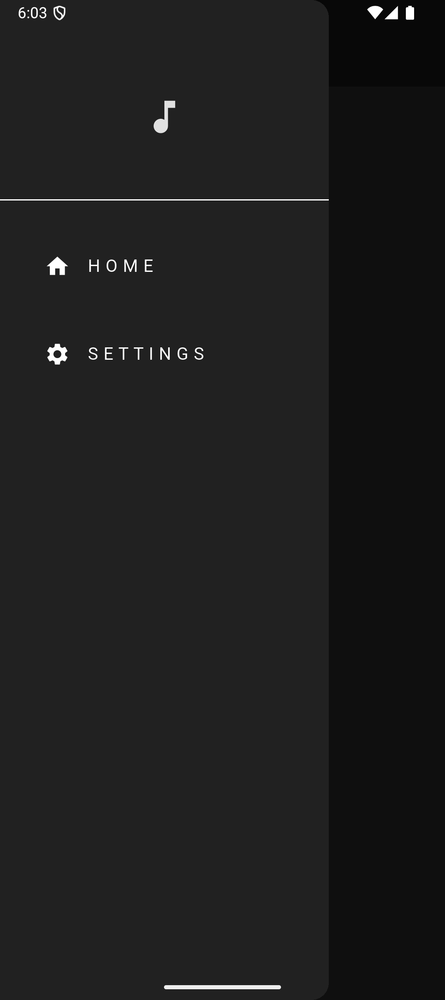
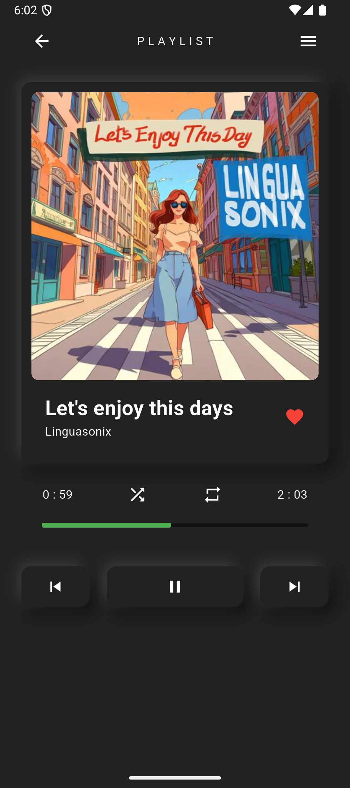
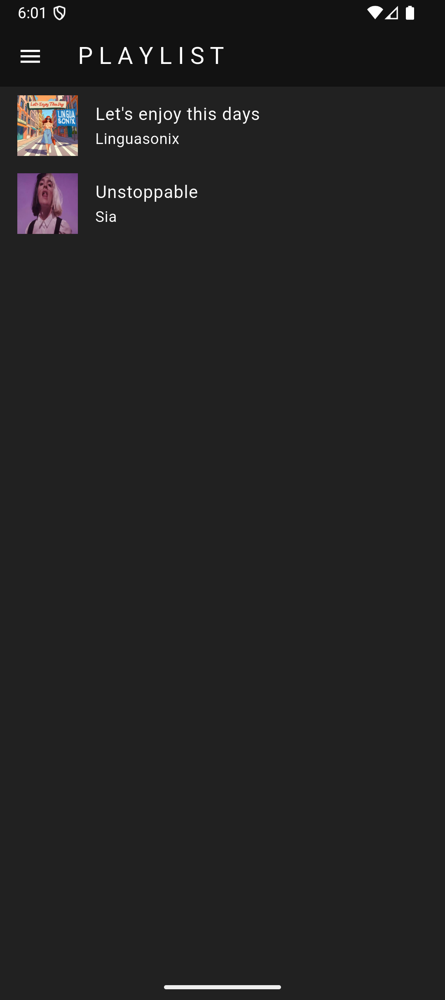

# 🎵 Music Player App (Flutter)

A beautifully designed and fully functional **offline music player app** built using **Flutter** and **Provider state management**.  
It scans local audio files, displays playlists, and provides smooth playback controls with an elegant neumorphic UI.

---

## 🚀 Features

- 🎧 **Play local songs** stored on the device  
- 🖼️ Beautiful **neumorphic UI design**  
- ▶️ **Play / Pause / Seek** controls  
- ⏭️ Skip Next / Previous  
- 🔁 Repeat & 🔀 Shuffle  
- 🎚️ Seekbar with real-time duration updates  
- 📂 Auto-detect and load audio from device storage  
- 📱 Background play support  
- ❤️ Favorite songs (UI placeholder, expandable)  
- 🔊 Volume and audio session management  
- 📦 Built with clean project structure & Provider (state management)

---

## 🛠️ Tech Stack

- **Flutter** (3.x)
- **Dart**
- **Provider** (state management)
- **audio_player** (audio player)
---

### 📸 App UI Preview

| Home Screen | Player Screen | Playlist Screen |
|-------------|---------------|-----------------|
|  |  |  |

---

## 🔧 How to Run the Project

1. Clone the repo:
   ```bash
   git clone https://github.com/Bhushan2000/music_player.git


